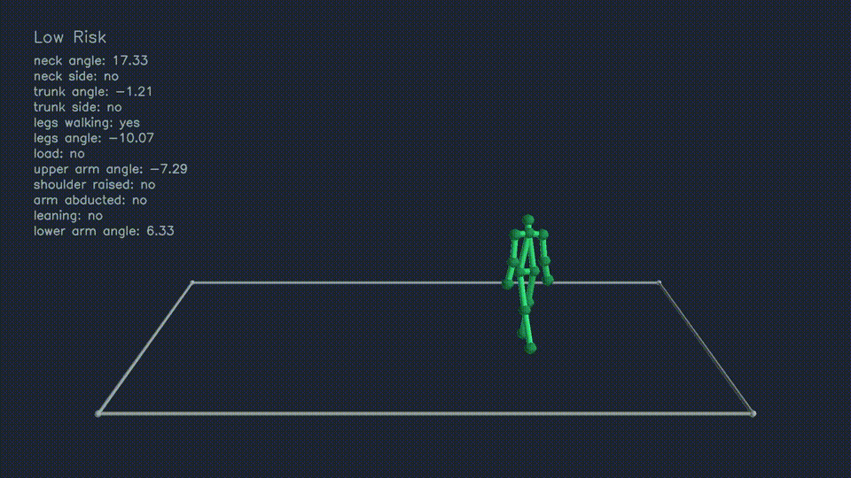

# Ergonomics
Ergonomics metrics: REBA score

</th>


### Installation

```
pip install ergonomics-metrics
```

### Example

```python
from ergonomics.reba import RebaScore
import requests
import numpy as np
import json

url = 'https://www.dropbox.com/s/e72lwn9n9gkoygj/ergonomics.json?dl=1'
r = requests.get(url)
sample_pose = np.array(r.json()['sample_pose'])

rebaScore = RebaScore()

body_params = rebaScore.get_body_angles_from_pose_right(sample_pose)
arms_params = rebaScore.get_arms_angles_from_pose_right(sample_pose)

rebaScore.set_body(body_params)
score_a, partial_a = rebaScore.compute_score_a()

rebaScore.set_arms(arms_params)
score_b, partial_b = rebaScore.compute_score_b()

score_c, caption = rebaScore.compute_score_c(score_a, score_b)

print("Score A: ", score_a, "Partial: ", partial_a)
print("Score A: ", score_b, "Partial: ", partial_b)
print("Score C: ", score_c, caption)

```

### Test


```
Pose Left

Neck Score: 2
Trunk Score: 2
Legs Score: 2
Upper Arm Score: 1
Lower Arm Score: 2
Wrist Score: 3

A Score: 4
B Score: 3
C score: 4
REBA score: 4

Pose Right

Neck Score: 2
Trunk Score: 2
Legs Score: 2
Upper Arm Score: 1
Lower Arm Score: 2
Wrist Score: 2

A Score: 4
B Score: 2
C score: 4
REBA score: 4

Rank
[0]'Negligible Risk',
[2-3]'Low Risk. Change may be needed',
[4-7]'Medium Risk. Further Investigate. Change Soon',
[8-10]'High Risk. Investigate and Implement Change',
[11+]'Very High Risk. Implement Change'
```
