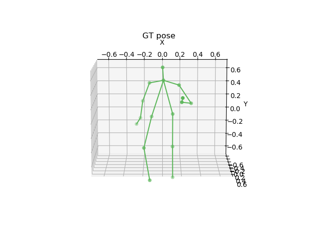
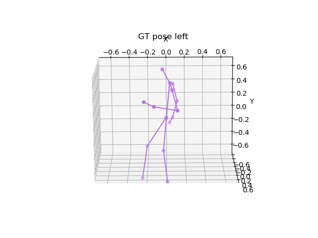
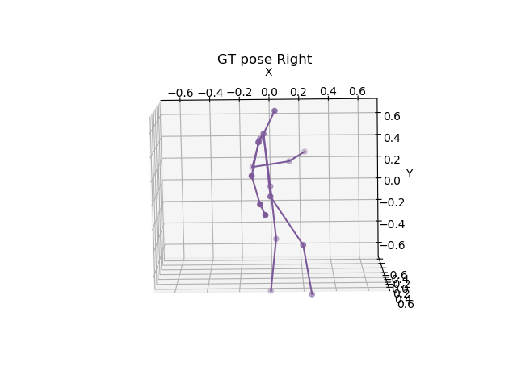

# Ergonomics
Ergonomics metrics: REBA score

<table class="tg">

  <tr>
    <th class="tg-baqh"></th>
    <th class="tg-baqh"></th>
    <th class="tg-baqh"></th>
  </tr>
  
</table>

```
Pose Left

Neck Score: 2
Trunk Score: 2
Legs Score: 2
Upper Arm Score: 1
Lower Arm Score: 2
Wrist Score: 3

A Score: 4
B Score: 3
C score: 4
REBA score: 4

Pose Right

Neck Score: 2
Trunk Score: 2
Legs Score: 2
Upper Arm Score: 1
Lower Arm Score: 2
Wrist Score: 2

A Score: 4
B Score: 2
C score: 4
REBA score: 4

Rank
[0]'Negligible Risk',
[2-3]'Low Risk. Change may be needed',
[4-7]'Medium Risk. Further Investigate. Change Soon',
[8-10]'High Risk. Investigate and Implement Change',
[11+]'Very High Risk. Implement Change'
```
